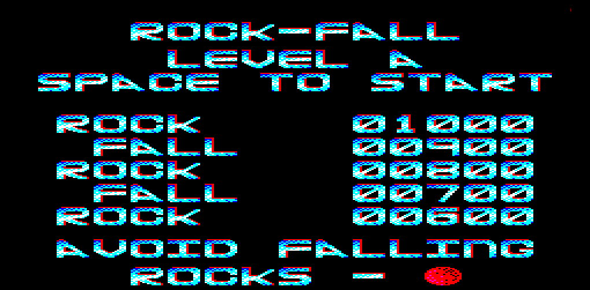
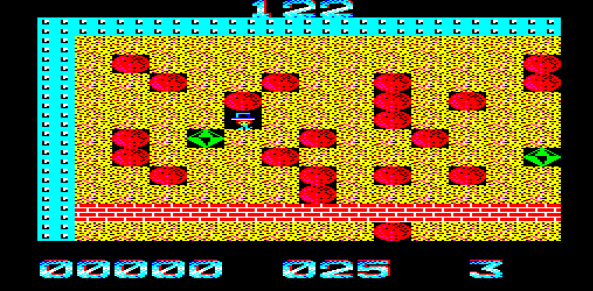

# QL_RockFall

Release executable consists of `Rockfall` and `Rockfall_code` files. `Rockfall` loads and executes the code file.

## Source

Source assembly file is `dev_boulder2_asm`, assembled to `dev_boulder2_c`

Graphics are in `Boulder1_grap`
Chunky font is in `Text_grap`
Individual levels are in `Boulder_cave<x>`

The BASIC file `dev_boulder` loads the code, graphics and cave definitions and saves them out as `Rockfall_code`.

`Map_ed3` is a level editor (some file names may need amending to run properly)

